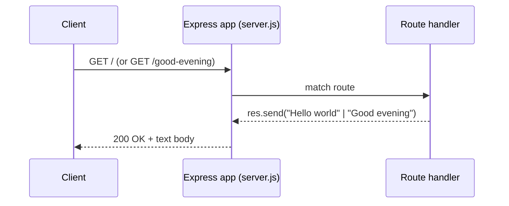
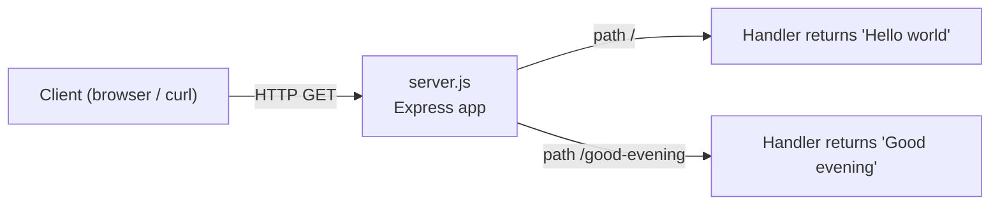

# Artifact14

*A minimal Node.js + Express tutorial server exposing two GET endpoints.*

## Overview

`Artifact14` is a minimal [Express.js](https://expressjs.com/) HTTP server intended as a runnable getting-started tutorial. It hosts exactly two GET endpoints — `GET /`, which returns `Hello world`, and `GET /good-evening`, which returns `Good evening`. Both responses are emitted as plain text, and the entire application lives in a single entry point, `server.js`. *(Source: server.js:L27, server.js:L32)*

## Prerequisites

- **[Node.js](https://nodejs.org/) `>= 18`** — the JavaScript runtime that executes `server.js`. Node 24 LTS is recommended for new projects, but any release `>= 18` satisfies the requirement. *(Source: package.json — `engines.node`)*
- **npm** — the package manager used to install dependencies and run the server. npm ships with Node.js, so installing Node also gives you npm.

## Project Structure

The project is intentionally flat — a single server file plus its manifest and supporting files:

```text
Artifact14/
├── README.md          # this tutorial
├── server.js          # Express app with two GET endpoints
├── package.json       # manifest (express dependency + start script)
├── package-lock.json  # generated lockfile (reproducible installs)
└── .gitignore         # ignores node_modules/
```

## Installation

Clone or download the repository, then install dependencies from the project root:

```bash
npm install
```

This reads `package.json`, installs [Express](https://www.npmjs.com/package/express) (`express ^5.2.1`), and generates `package-lock.json` along with the `node_modules/` directory. *(Source: package.json — `dependencies.express`)*

## Running the Server

Start the server with the npm `start` script (equivalently, `node server.js`):

```bash
npm start
# equivalently:
node server.js
```

By default the server listens on **`http://localhost:3000`** and prints `Server listening on http://localhost:3000` to the console once it is ready. *(Source: package.json — `scripts.start`; server.js:L39)*

## API / Endpoint Reference

The server exposes two GET endpoints. Each returns its response as plain text with the `Content-Type` shown below (Express's default for `res.send(string)`).

| Method | Path | Response (verbatim) | Content-Type | Source |
|--------|------|---------------------|--------------|--------|
| `GET` | `/` | `Hello world` | `text/html; charset=utf-8` | server.js:L27 |
| `GET` | `/good-evening` | `Good evening` | `text/html; charset=utf-8` | server.js:L32 |

## Example Requests

With the server running, call each endpoint from another terminal.

**`GET /`** — returns `Hello world`:

```bash
curl -s http://localhost:3000/
# → Hello world
```

**`GET /good-evening`** — returns `Good evening`:

```bash
curl -s http://localhost:3000/good-evening
# → Good evening
```

## Request Flow

The diagram below traces the lifecycle of a request to either endpoint, from the client through the Express app to the matching route handler and back:



The next diagram shows how the single server file dispatches each path to its own handler:



## Notes

**Port configuration.** The server listens on port `3000` by default. Override it by setting the `PORT` environment variable before starting the server:

```bash
PORT=8080 npm start
```

The default and the override are both governed by the expression `process.env.PORT || 3000`. *(Source: server.js:L38)*
